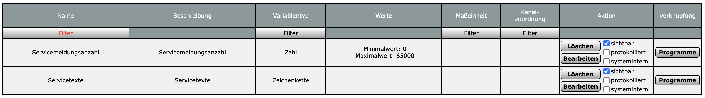
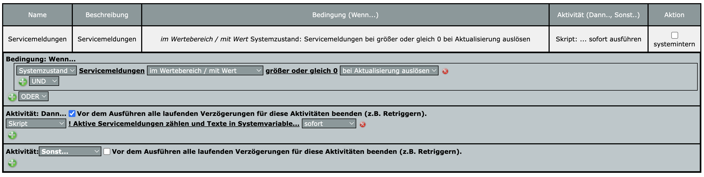
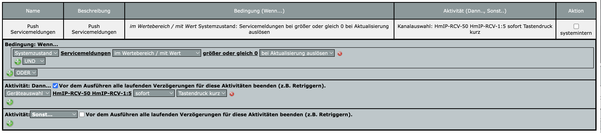

# Servicemeldungen  

Zur Verwendung dieses Moduls als Privatperson, Einrichter oder Integrator wenden Sie sich bitte zunächst an den Autor.

Für dieses Modul besteht kein Anspruch auf Fehlerfreiheit, Weiterentwicklung, sonstige Unterstützung oder Support.  
Bevor das Modul installiert wird, sollte unbedingt ein Backup von IP-Symcon durchgeführt werden.  
Der Entwickler haftet nicht für eventuell auftretende Datenverluste oder sonstige Schäden.  
Der Nutzer stimmt den o.a. Bedingungen, sowie den Lizenzbedingungen ausdrücklich zu.

### Inhaltsverzeichnis

1. [Modulbeschreibung](#1-modulbeschreibung)
2. [Voraussetzungen](#2-voraussetzungen)
3. [Schaubild](#3-schaubild)
4. [Homematic Servicemeldungen](#4-homematic-servicemeldungen)
5. [PHP-Befehlsreferenz](#5-php-befehlsreferenz)
   1. [Daten aktualisieren](#51-daten-aktualisieren)
6. [CCU Konfiguration](#6-ccu-konfiguration)
   1. [Systemvariablen](#61-systemvariablen)
   2. [Programm Servicemeldungen](#62-programm-servicemeldungen)
   3. [Skript](#63-skript)
   4. [Programm Push Servicemeldungen](#64-programm-push-servicemeldungen)

### 1. Modulbeschreibung

Dieses Modul überwacht die Servicemeldungen einer Homematic CCU Zentrale in [IP-Symcon](https://www.symcon.de).  

### 2. Voraussetzungen

- IP-Symcon ab Version 8
- Homematic Extended Modul

### 3. Schaubild

```
                                                  +--------------------------+
                                                  | Servicemeldungen (Modul) |
                                                  |                          |
HomeMatic Extended Servicemeldungen <-------------+ Servicemeldungen         |
                                                  |                          |
                                                  +--------------------------+
```

### 4. Homematic Servicemeldungen

Das Modul reagiert auf Aktualisierungsänderungen von Homematic Extended Servicemeldungen und kann Benachrichtigungen auslösen.

### 5. PHP-Befehlsreferenz

#### 5.1 Daten aktualisieren

```
void SM_UpdateData(integer INSTANCE_ID);
```

Der Befehl liefert keinen Rückgabewert.

| Parameter     | Wert  | Bezeichnung    |
|---------------|-------|----------------|
| `INSTANCE_ID` |       | ID der Instanz |

Beispiel:  
> SM_UpdateData(12345);

### 6. CCU Konfiguration

#### 6.1 Systemvariablen

Erstelle auf der CCU zwei neue Systemvariablen mit dem Namen `Servicemeldungsanzahl` und `Servicetexte`.  

[]()


#### 6.2 Programm Servicemeldungen

Erstelle auf der CCU ein neues Programm mit dem Namen `Servicemeldungen` und nimm die Konfiguration vor.

[]()

#### 6.3 Skript

Füge das nachfolgende `Skript` in das Programm ein.

```
! Aktive Servicemeldungen zählen und Texte in Systemvariable schreiben

object oTmpArray = dom.GetObject(ID_SERVICES);
integer errorCount = 0;
string serviceTexts = "";

if(oTmpArray) {
  string sTmp;
  foreach(sTmp, oTmpArray.EnumIDs()) {
    object oTmp = dom.GetObject(sTmp);
    if (oTmp) {
      if (oTmp.IsTypeOf(OT_ALARMDP) && (oTmp.AlState() == asOncoming)) {
        errorCount = errorCount + 1;
        string deviceName = "";
        string serialNumber = "";
        string msgText = "";
        string timeText = "";
        object trigDP = dom.GetObject(oTmp.AlTriggerDP());
        time sftime = oTmp.AlOccurrenceTime();
        if(trigDP) {
          object och = dom.GetObject(trigDP.Channel());
          if(och) {
            object odev = dom.GetObject(och.Device());
            if(odev) {
              deviceName = odev.Name();
              serialNumber = odev.Address();
            }
          }
          string hssType = trigDP.HssType();
          ! Übersetzung mit einzelnen ifs
          if (hssType == "LOWBAT") { msgText = "Batterieladezustand gering"; }
          if (hssType == "LOW_BAT") { msgText = "Batterieladezustand gering"; }
          if (hssType == "UNREACH") { msgText = "Gerätekommunikation gestört"; }
          if (hssType == "CONFIG_PENDING") { msgText = "Konfigurationsdaten stehen zum Transfer an"; }
          if (hssType == "STICKY_UNREACH") { msgText = "Gerätekommunikation gestört"; }
          if (hssType == "ERROR_COMMUNICATION_SENSOR") { msgText = "Kommunikationsfehler"; }
          if (hssType == "UPDATE_PENDING") { msgText = "Update verfügbar"; }
          if (hssType == "SABOTAGE") { msgText = "Sabotage"; }
          if (hssType == "ERROR_SABOTAGE") { msgText = "Sabotage"; }
          if (hssType == "ERROR_REDUCED") { msgText = "Temperatur kritisch (Lastabsenkung)"; }
          if (hssType == "ERROR_OVERLOAD") { msgText = "Aktor überlastet"; }
          if (hssType == "ERROR_JAMMED") { msgText = "Schließmechanismus blockiert"; }
          if (hssType == "ERROR_OVERHEAT") { msgText = "Aktor überhitzt"; }
          ! Wenn keine Übersetzung, dann Originaltext
          if (msgText == "") { msgText = hssType; }
        }
        if (sftime) {
          timeText = sftime.Format("%d.%m.%Y %H:%M:%S");
        }
        serviceTexts = serviceTexts # deviceName # " | " # serialNumber # " | " # msgText # " | " # timeText # "***\n";
      }
    }
  }
}

dom.GetObject("Servicemeldungsanzahl").State(errorCount);
dom.GetObject("Servicetexte").State(serviceTexts);

WriteLine("Anzahl Servicemeldungen: " # errorCount);
WriteLine("Servicemeldungstexte:\n" # serviceTexts);
```

#### 6.4 Programm Push Servicemeldungen

Damit später Symcon die Daten nicht pollen muss, wird eine virtuelle Fernbedienung verwendet.
Diese muss in Symcon unter dem Modul Systemvariablen (HomeMatic Extended Library) zugewiesen werden.

Erstelle auf der CCU ein neues Programm mit dem Namen `Push Servicemeldungen` und nimm die Konfiguration vor.

[]()